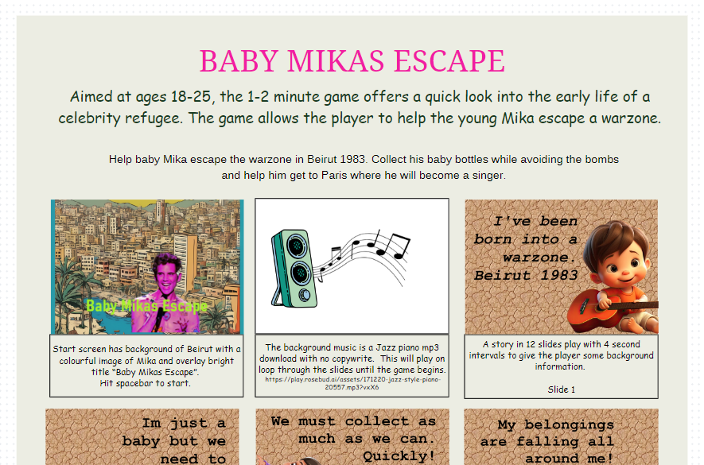

# Baby Mikas Escape
Aimed at ages 18-25, the 1-2 minute game offers a quick look into the early life of a celebrity refugee. The game allows the player to help the young Mika escape a warzone.

## End mission:
Help baby Mika escape the warzone in Beirut 1983. Collect his baby bottles while avoiding the bombs and help him get to Paris where he will become a singer.

## Link to my storyborad on Canva: 
https://www.canva.com/design/DAGGgTL4rJw/KtXGGfUVo-DAzn9n42MbOA/edit?utm_content=DAGGgTL4rJw&utm_campaign=designshare&utm_medium=link2&utm_source=sharebutton

## Project Brief

This project was my first brief when starting my internship with BIZGEES. The brief:

* Select a celebrity who was a refugee.

* Compile the information and background.

* Create a short 30 second - 2 minute game aimed at age group 18 -25.

* The game is to allow the player to learn about the refugee.

* Use AI to aid the creation.

I chose the singer Mika.

## Technologies used

For the project the aim was to use AI, mainly Rosebud AI (https://play.rosebud.ai/home)

On the platform a developer can clone games created by other developers and change them for their own purpose. 

I chose to use a game called Fall Boy, Evolved from: 2D Playground, Created by: AdamBrody.

Although Rosebud can generate AI images, I created all mine in Photoshop. 
Rosebud also allows the AI chat to change code, however, this didn't work for me so I went into the code myself and changed it. 

If I were to expand the game further, it would include more levels including a level with a Parisian scene, and an older Mika collecting misical notes. 